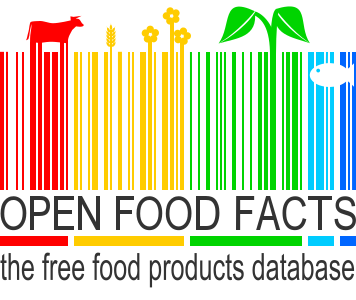

_As ecology grows a more important concern, populations need not only to focus on driving less or consuming less, but also on how they consume food. It is a known fact that consuming products derived from palm oil, or meat in general is much more damaging for the environment than growing your own vegetables. During this project, we aim to expose how to be more regarding towards the environment in our daily food consumption. We will use a dataset of the Open Food Facts Database and look into where the food comes and how much it has had to travel._

<p align="center">
  
</p>


## Overview of the dataset
Open Food Facts (OFF) is a crowdfunded database where people enter all kind of infomration found on the product itself. It can be characteristics of the product : the quantity, the packaging, the brand, the label, manufacturing place, store/country where it is sold and the categorie of the product. As well as the ingredients (which are then classify whether there are additive, they contain palm oil) and the nutrion facts.

The provided database contains 681602 products in total coming from XXX different countries. Unfortunatly not all the countries are similarly well represented by the product, thus we decided to focus on France.

Include graph nbr product per country 

## Distance travelled


## Welcome to GitHub Pages

You can use the [editor on GitHub](https://github.com/jev26/test.github.io/edit/master/index.md) to maintain and preview the content for your website in Markdown files.

Whenever you commit to this repository, GitHub Pages will run [Jekyll](https://jekyllrb.com/) to rebuild the pages in your site, from the content in your Markdown files.

### Markdown

Markdown is a lightweight and easy-to-use syntax for styling your writing. It includes conventions for

```markdown
Syntax highlighted code block

# Header 1
## Header 2
### Header 3

- Bulleted
- List

1. Numbered
2. List

**Bold** and _Italic_ and `Code` text

[Link](url) and 
```

For more details see [GitHub Flavored Markdown](https://guides.github.com/features/mastering-markdown/).

### Jekyll Themes

Your Pages site will use the layout and styles from the Jekyll theme you have selected in your [repository settings](https://github.com/jev26/test.github.io/settings). The name of this theme is saved in the Jekyll `_config.yml` configuration file.

### Support or Contact

Having trouble with Pages? Check out our [documentation](https://help.github.com/categories/github-pages-basics/) or [contact support](https://github.com/contact) and we’ll help you sort it out.
